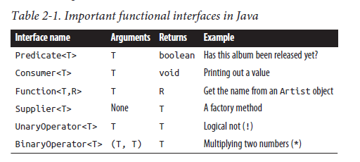

# Functional Programming
**functional programming** is a programming paradigm—a style of building the structure and elements of computer programs—that treats **computation as the evaluation of mathematical functions and avoids changing-state and mutable data**. It is a declarative programming paradigm, which means programming is done with **expressions or declarations** instead of statements.
 
## Concepts
* `Imperative style`: Telling programs what to do, as well as **how to do** it
* `Declarative style`: Still tell the program **what to do**, but you leave the implementation details to the underlying library of functions. 
* `Functional style`: Functional programming combines declarative methods with higher order functions.

---
* `Higher order functions` are simple functions that can receive functions as arguments and can return another function as results.
* `Functional Interface`: Any interface with a SAM(Single Abstract Method) is a functional interface, and **its implementation may be treated as lambda expressions**.

# Lambda Expression
A lambda expression is a method without a name that is used to pass around behavior
as if it were data

## Functional Interfaces


## Examples

```java
(int a) -> a * 2; // Calculate the double of a
a -> a * 2; // or simply without type

(a, b) -> a + b; // Sum of 2 parameters

//If the lambda is more than one expression we can use { } and return
// Not good example, functional style programming should immutable and 
// without variables
(x, y) -> {
    int sum = x + y;
    int avg = sum / 2;
    return avg;
}
```

A lambda expression cannot stand alone in Java, it need to be associated to a functional interface.

```java
interface MyMath {
    int getDoubleOf(int a);
}
    
MyMath d = a -> a * 2; // associated to the interface
d.getDoubleOf(4); // is 8
```

## Articles
* https://dzone.com/articles/supplier-and-consumer-interface-in-java8

# Streams
* It’s very easy to figure out whether an operation is eager or lazy: look at what it returns. If it gives you back a Stream, it’s lazy; if it gives you back another value or void, then it’s eager.
* Internal iteration is a way of iterating over a collection that delegates more control over the iteration to the collection.
* A Stream is the internal iteration analogue of an Iterator.
* Many common operations on collections can be performed by combining methods on Stream with lambda expressions.

# Method 
## Default method
**Default Method” or (Defender methods)** allows a developer to add new methods to the Interfaces without breaking the existing implementation of these Interface.

```java
public interface Parent {
    public void message(String body);
    public default void welcome() {
        message("Parent: Hi!");
    }
    public String getLastMessage();
}
```

Rule 
* Any class wins over any interface. So if there’s a method with a body, or an abstract declaration, in the superclass chain, we can ignore the interfaces completely
* Subtype wins over supertype. If we have a situation in which two interfaces are competing to provide a default method and one interface extends the other, the subclass wins.
* No rule 3. If the previous two rules don’t give us the answer, the subclass must either implement the method or declare it abstract.

## Method Expressions Class::staticMethod


# References
* https://github.com/BafS/Java8-CheatSheet
* http://www.r-5.org/files/books/computers/languages/java/fp/Richard_Warburton-Java_8_Lambdas-EN.pdf
