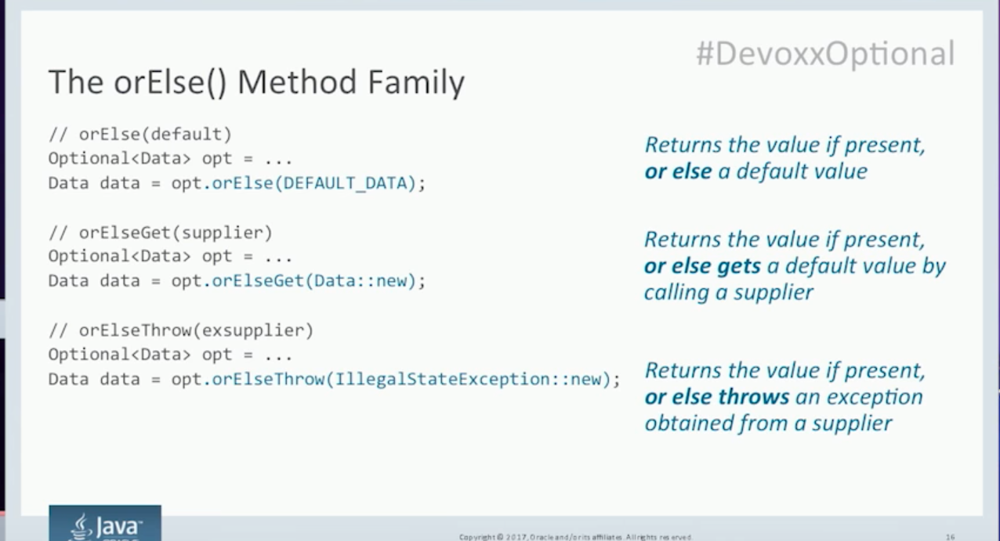

# Optional
A container object which may or may not contain a non-null value. If a value is present, isPresent() will return true and get() will return the value.

## APIs
### Static factory methods
* Optional.empty()
* Optional.of(T)
* Optional.ofNullable(ref)

### orElse Family
https://www.youtube.com/watch?v=fBYhtvY19xA

## Rules

# Lambda

# References
* https://www.youtube.com/watch?v=fBYhtvY19xA
* [API Design With Java 8 Lambda and Streams](https://www.youtube.com/watch?v=9uTVXxJjuco)
